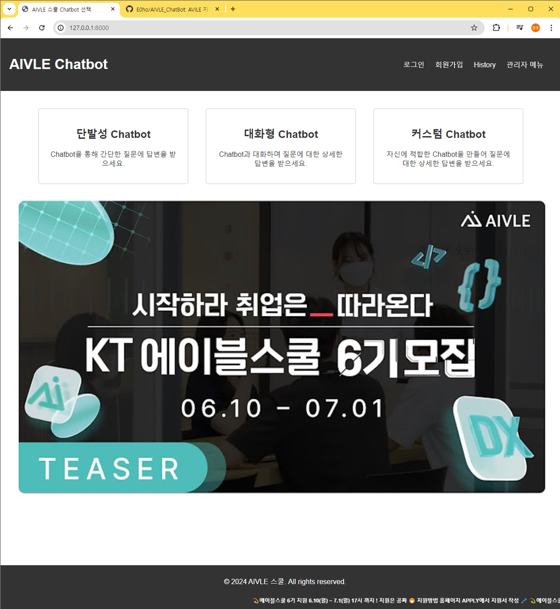
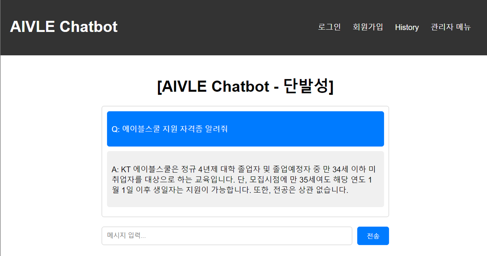
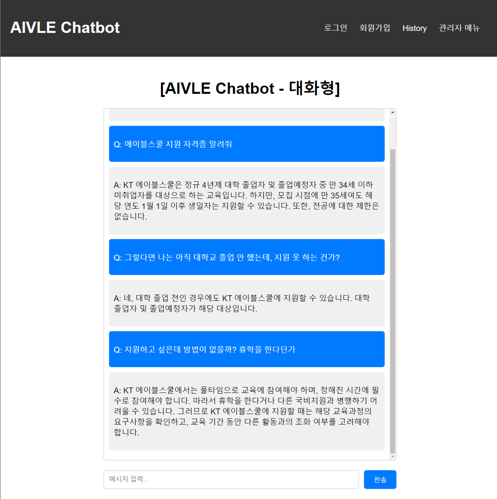
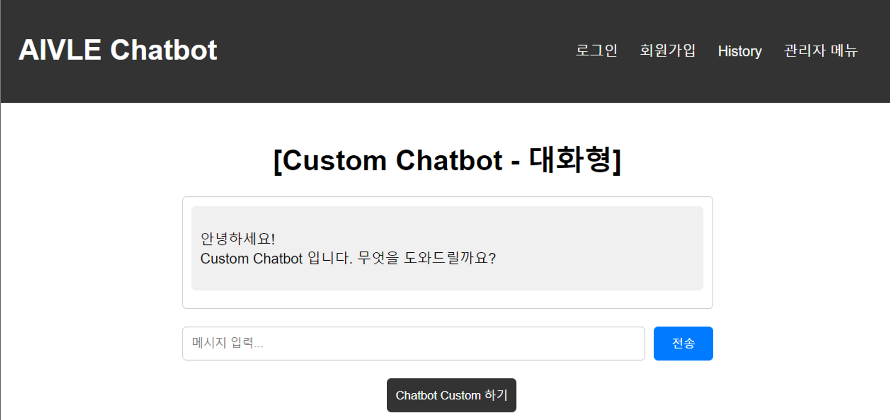
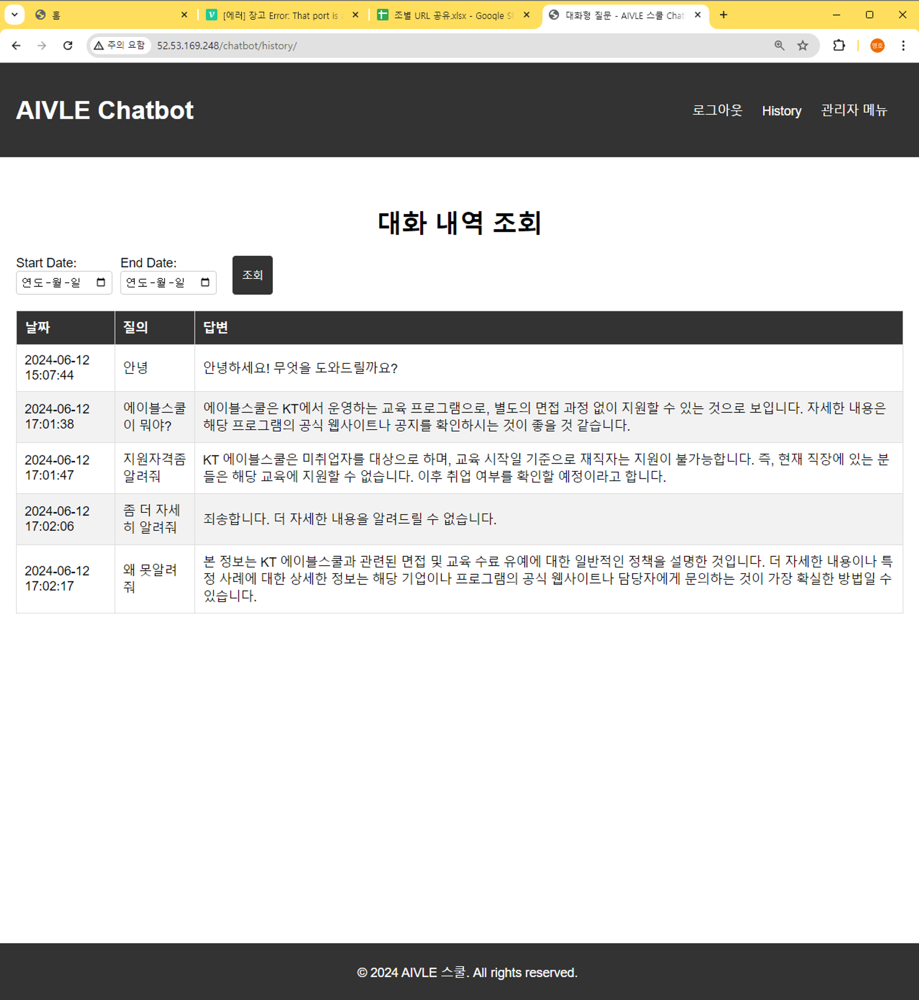
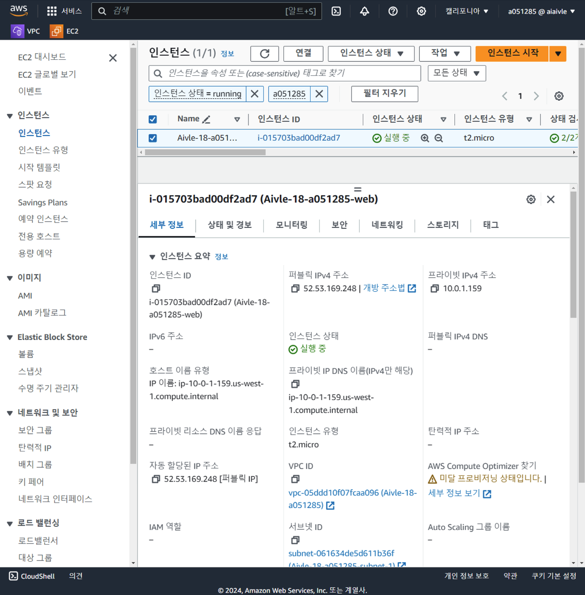

# AIVLE School RAG Chatbot 프로젝트

## 소개
이 프로젝트는 AIVLE School 과정 중 학생들의 반복적인 질문으로 인한 시간 낭비를 줄이고자 \
LangChain 라이브러리를 활용한 Retrieval-Augmented Generation (RAG) 기반 챗봇을 개발한 프로젝트입니다.
 
 

## 개발 배경
기존 AIVLE Chatbot은 단순 GPT LLM 모델로서, AIVLE School에 대한 도메인 정보가 부족하고 최신 정보를 반영하지 못해, 부정확한 답변을 제공합니다. \
이에 학생들은 해당 Chatbot 서비스를 이용하지 않았고, 이를 개선한 Chatbot의 필요성을 느끼게 되었습니다.
 
 

## 문제 해결 과정
이러한 문제를 해결하기 위해, 다음과 같은 단계로 개선된 챗봇을 개발하였습니다:

1. **데이터 수집**: 이전에 발생한 Q&A 정보와 최신 AIVLE School 관련 도메인 정보 크롤링
2. **벡터 데이터베이스 구축**: 수집된 데이터를 Q/A 형식으로 벡터 데이터베이스에 저장
3. **챗봇 설계**: LangChain 라이브러리를 활용하여 GPT LLM 모델과 벡터 데이터베이스를 체인 구조로 결합

새로운 질문이 발생하면 벡터 데이터베이스에서 코사인 유사도가 가장 높은 Q/A 세트를 검색하여 GPT LLM 모델에 입력하는 Prompt Tuning 기법 Chatbot 개발
 
 

## 유지보수
- 최신 도메인 정보와 새로운 Q/A 정보를 계속해서 반영하기 위해, CSV 파일 업로드시 AIVLE Domain Vector DB에 추가하는 기능 개발
 
 
## 기술 스택 및 배포
- **기술 스택**: Python, LangChain, GPT-3.5 (4.0), AWS EC2
- **배포**: AWS EC2 인스턴스를 통해 배포

 
 
 
 
 

# 결과물
###  메인 페이지

### 단발성 Chatbot

### 대화형 Chatbot

### 커스텀 Chatbot

### Log 관리

### 배포

